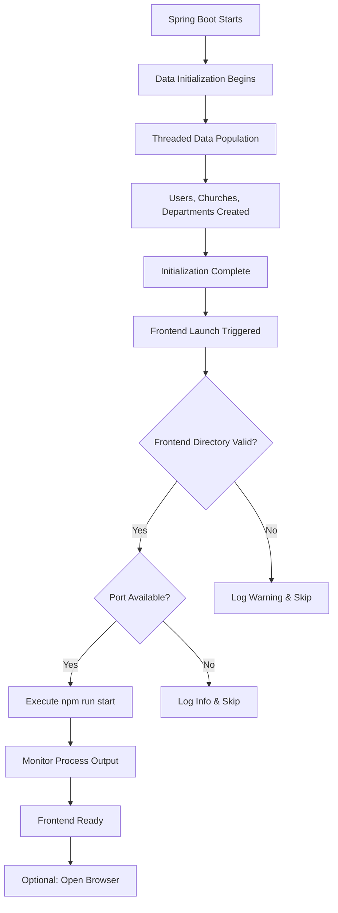

# 🚀 Frontend Auto-Launch System

## Overview
This system automatically launches the React frontend application when the Spring Boot backend completes its data initialization process.

## 🎯 Key Features

### 1. **Automatic Frontend Launch**
- Monitors backend initialization completion
- Launches React app using `npm run start`
- Configurable through application properties
- Cross-platform support (Windows/Linux/Mac)

### 2. **Intelligent Process Management**
- Checks if frontend is already running
- Validates frontend directory and package.json
- Monitors frontend process output
- Handles process lifecycle (start/stop)

### 3. **Configuration Options**
```yaml
app:
  frontend:
    path: "E:/2025/storyLine/react_demo/sda_acm_2025/sda_acm_webapp"
    auto-launch: true
    port: 3000
    open-browser: true
```

## 🏗️ Architecture

### Components

#### 1. **FrontendLauncherService**
```java
@Service
public class FrontendLauncherService {
    // Manages frontend process lifecycle
    // Validates environment prerequisites
    // Monitors process output and status
}
```

#### 2. **DataInitializationService Integration**
```java
// After successful data initialization
log.info("🚀 Backend initialization complete - launching frontend application...");
frontendLauncherService.launchFrontendIfReady();
```

#### 3. **REST API Endpoints**
- `GET /api/data/status` - Includes frontend status
- `POST /api/data/launch-frontend` - Manual frontend launch
- `POST /api/data/stop-frontend` - Stop frontend process

## 🔄 Process Flow



## 🛠️ Implementation Details

### 1. **Environment Validation**
```java
private boolean isFrontendDirectoryValid() {
    File frontendDir = new File(frontendPath);
    if (!frontendDir.exists() || !frontendDir.isDirectory()) {
        return false;
    }
    // Check if package.json exists
    File packageJson = new File(frontendDir, "package.json");
    return packageJson.exists();
}
```

### 2. **Process Management**
```java
ProcessBuilder processBuilder = new ProcessBuilder();
processBuilder.directory(new File(frontendPath));

if (System.getProperty("os.name").toLowerCase().contains("windows")) {
    processBuilder.command("cmd", "/c", "npm", "run", "start");
} else {
    processBuilder.command("npm", "run", "start");
}
```

### 3. **Output Monitoring**
```java
private void monitorFrontendProcess() {
    CompletableFuture.runAsync(() -> {
        try (BufferedReader reader = new BufferedReader(new InputStreamReader(frontendProcess.getInputStream()))) {
            String line;
            while ((line = reader.readLine()) != null) {
                if (line.contains("webpack compiled") || line.contains("compiled successfully")) {
                    log.info("🎉 Frontend application is ready!");
                    openBrowserIfConfigured();
                }
            }
        }
    });
}
```

## 📊 Status Monitoring

### Backend Status Response
```json
{
  "userCount": 50,
  "churchCount": 15,
  "departmentCount": 15,
  "complete": true,
  "frontend": {
    "running": true,
    "status": "Running on port 3000"
  }
}
```

### Frontend Status Values
- `"Not started"` - Auto-launch disabled or not triggered
- `"Running on port 3000"` - Process active and healthy
- `"Launched but process ended"` - Process started but terminated
- `"Auto-launch disabled"` - Configuration disabled

## 🎮 Manual Controls

### Launch Frontend
```bash
curl -X POST http://localhost:8080/api/data/launch-frontend
```

### Stop Frontend
```bash
curl -X POST http://localhost:8080/api/data/stop-frontend
```

### Check Status
```bash
curl http://localhost:8080/api/data/status
```

## 🔧 Configuration Options

### Application Properties
```yaml
app:
  frontend:
    path: "E:/2025/storyLine/react_demo/sda_acm_2025/sda_acm_webapp"  # Frontend directory
    auto-launch: true           # Enable/disable auto-launch
    port: 3000                 # Expected frontend port
    open-browser: true         # Auto-open browser when ready
```

### Environment Variables (Alternative)
```bash
APP_FRONTEND_PATH=E:/2025/storyLine/react_demo/sda_acm_2025/sda_acm_webapp
APP_FRONTEND_AUTO_LAUNCH=true
APP_FRONTEND_PORT=3000
```

## 🚦 Startup Sequence

1. **Backend Starts** (Port 8080)
2. **Database Connection** Established
3. **Threaded Data Initialization** Begins
   - Users: 50 realistic records
   - Churches: 15 realistic records  
   - Departments: 15 realistic records
4. **Progress Updates** via Intelligent Polling
5. **Initialization Complete** Event
6. **Frontend Launch** Triggered
7. **React App Starts** (Port 3000)
8. **Browser Opens** (Optional)

## 🎯 Benefits

### 1. **Developer Experience**
- One-command startup for full-stack development
- No manual frontend launch required
- Automatic browser opening
- Real-time status monitoring

### 2. **Production Readiness**
- Configurable auto-launch (can be disabled)
- Robust error handling
- Process lifecycle management
- Health monitoring

### 3. **Integration**
- Seamless with existing intelligent polling system
- Works with Java Faker realistic data generation
- Compatible with Docker environment setup

## 🔍 Troubleshooting

### Common Issues

1. **Frontend Directory Not Found**
   ```
   Frontend directory not found or invalid: E:/path/to/frontend
   ```
   **Solution**: Verify the path in application.yml

2. **npm Command Not Found**
   ```
   Failed to start frontend application: npm not found
   ```
   **Solution**: Ensure Node.js and npm are installed and in PATH

3. **Port Already in Use**
   ```
   Frontend port 3000 is already in use, skipping launch
   ```
   **Solution**: Stop existing process or change port configuration

4. **Permission Issues**
   ```
   Failed to start frontend application: Permission denied
   ```
   **Solution**: Check directory permissions and npm installation

## 🎉 Success Indicators

### Console Output
```
🚀 Backend initialization complete - launching frontend application...
🚀 Starting React frontend application...
Frontend path: E:/2025/storyLine/react_demo/sda_acm_2025/sda_acm_webapp
✅ Frontend application started successfully!
🌐 Frontend should be available at: http://localhost:3000
Frontend: webpack compiled successfully
🎉 Frontend application is ready and compiled successfully!
🌐 Opened browser to: http://localhost:3000
```

### API Response
```json
{
  "message": "Frontend launch initiated",
  "status": "Running on port 3000"
}
```

This system provides a seamless full-stack development experience by automatically coordinating the backend data initialization with frontend application startup.
